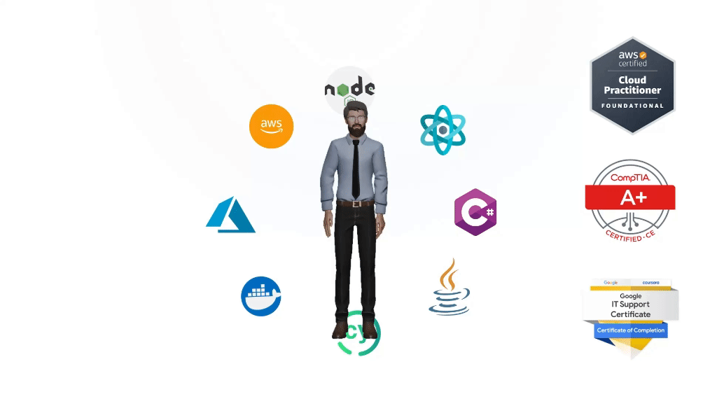

  

  

### Hi there! Welcome to my repositories! How is it going? 👋🚀

- 💻 NodeJS, ReactJS, NextJS, JavaScript, TypeScript, Java, SpringBoot, AWS, DevOps.
- ✨ Always learning in order to be better than yesterday.

# 💻 My favorite tools and technologies

<table align="center">
  <tr>
    <td align="center" width="90">
        
       React
    </td>
    <td align="center" width="90">
        
       Vue
    </td>
    <td align="center" width="90">
        
       NextJS
    </td>
    <td align="center" width="90">
        
       Angular
    </td>
    <td align="center"  width="90">
        
       HTML5
    </td>
    <td align="center" width="90">
        
       CSS
    </td>
    <td align="center"  width="90">
        
       Bootstrap
    </td>
    <td align="center" width="90">
        
       Tailwind
    </td>
    <td align="center width="90">
      
       JavaScript
    </td>
    <td align="center width="90">
      
       TypeScript
    </td>
    <td align="center" width="90">
        
       jQuery
    </td>
  </tr>
  <tr>
    <td align="center" width="90">
        
       Java
    </td>
    <td align="center" width="90">
        
       SpringBoot
    </td>
    <td align="center" width="90">
        
       C++
    </td>
    <td align="center" width="90">
        
       C#
    </td>
    <td align="center" width="90">
        
       Python
    </td>
    <td align="center" width="90">
        
       Django
    </td>
    <td align="center" width="90">
        
       NodeJS
    </td>
    <td align="center" width="90">
        
       NestJS
    </td>
    <td align="center" width="90">
        
       Qt
    </td>
    <td align="center" width="90">
        
       Flutter
    </td>
    <td align="center" width="90">
        
       Android
    </td>
  </tr>
  <tr>
    <td align="center" width="90">
      
       MySQL
    </td>
    <td align="center" width="90">
      
       PostgreSQL
    </td>
    <td align="center" width="90">
      
       SQLite
    </td>
    <td align="center" width="90">
      
       MongoDB
    </td>
    <td align="center" width="90">
      
       GitHub
    </td>
    <td align="center" width="90">
      
       AWS
    </td>
      <td align="center" width="90">
      
       Docker
    </td>
  </tr>
</table>
  

### GitHub Stats

### 

